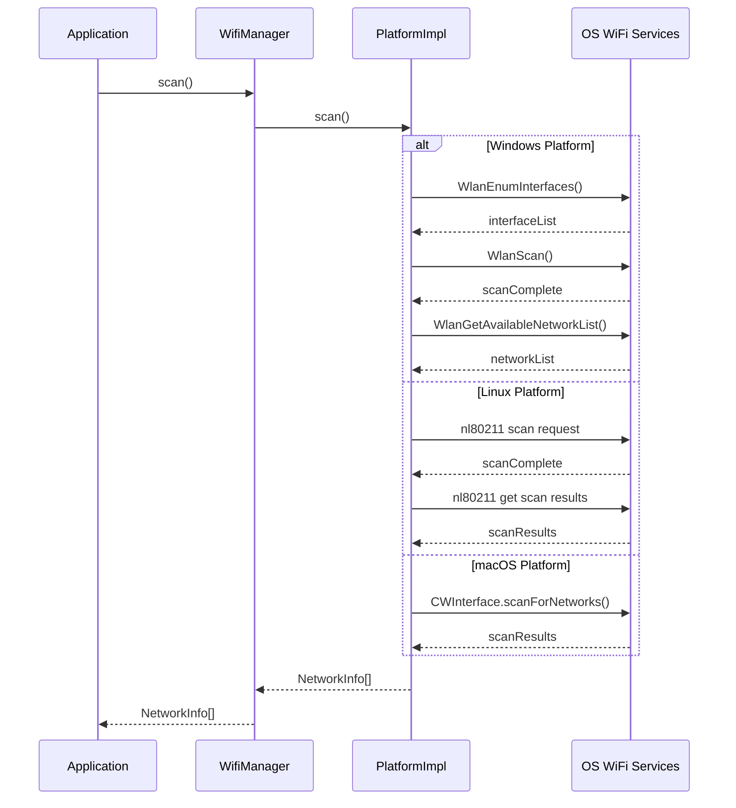
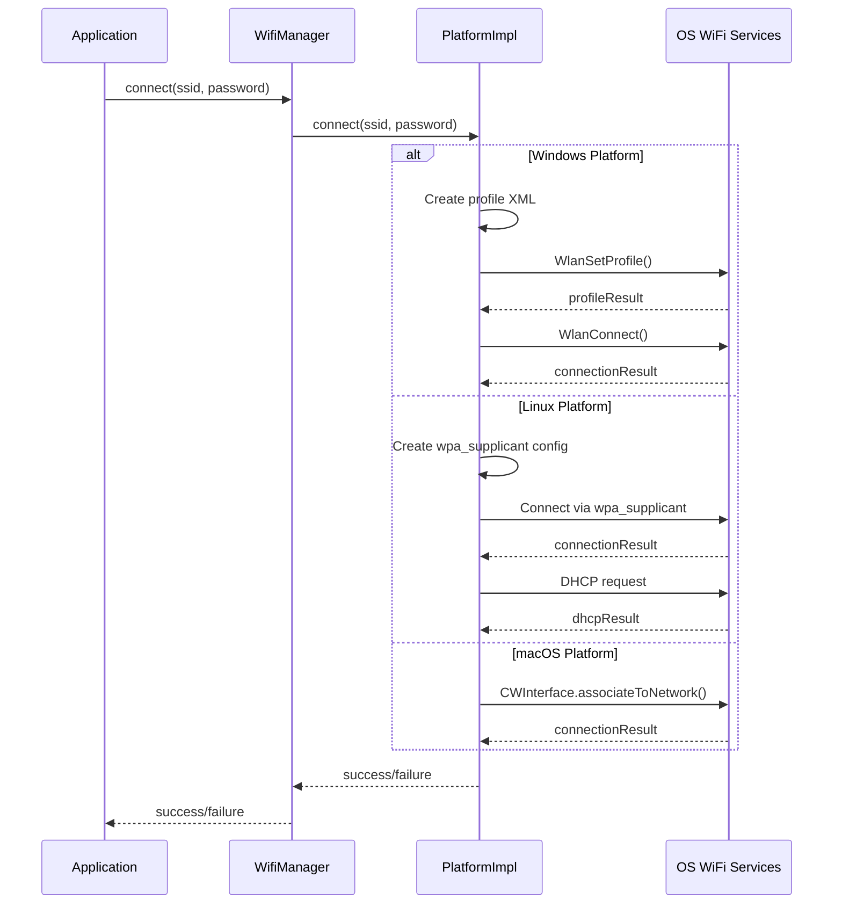
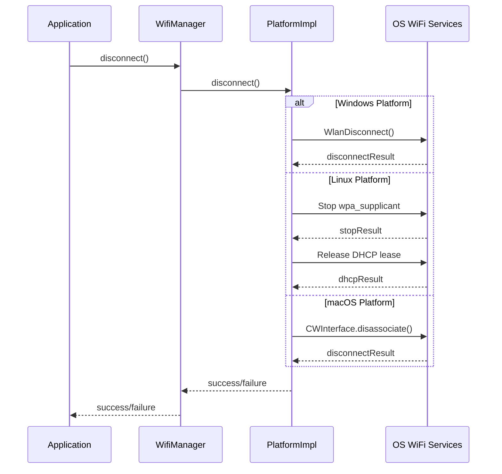
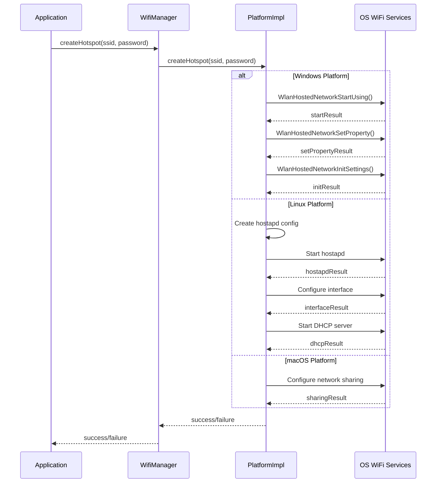

# libwificpp: Cross-Platform WiFi Management Library

A comprehensive WiFi management library written in C++ with bindings for Rust, providing a unified API for WiFi operations across multiple platforms.

## Features

- **Cross-Platform Support**:
  - Windows (using WLAN API)
  - Linux (using nl80211/netlink)
  - macOS (using CoreWLAN)
  - iOS (limited functionality, using NetworkExtension)
  - Android (using JNI bridge to Android WiFi API)
  - RTOS (ESP32, Zephyr, FreeRTOS, ThreadX)

- **Core Functionality**:
  - Network scanning with detailed information
  - Connection management (connect/disconnect)
  - Connection status monitoring
  - Hotspot creation and management
  - Platform-specific optimizations

- **Language Support**:
  - Native C++ API
  - C API for FFI compatibility
  - Rust bindings

## Architecture

The library uses a platform abstraction layer to provide consistent behavior across different operating systems:

```
┌───────────────────┐      ┌──────────────────┐
│ Application Layer │      │ Rust Application │
└─────────┬─────────┘      └────────┬─────────┘
          │                         │
┌─────────▼─────────┐      ┌────────▼─────────┐
│  WifiManager API  │      │   wifi-rs API    │
└─────────┬─────────┘      └────────┬─────────┘
          │                         │
┌─────────▼─────────┐      ┌────────▼─────────┐
│  Platform Layer   │      │      C API       │
└─────────┬─────────┘      └────────┬─────────┘
          │                         │
┌─────────▼────────────────────────▼─────────┐
│              libwificpp core               │
└───────────┬───────────┬───────────┬────────┘
            │           │           │
   ┌────────▼───┐ ┌─────▼─────┐ ┌───▼────┐
   │  Windows   │ │   Linux   │ │  macOS │ ...
   └────────────┘ └───────────┘ └────────┘
```

## Prerequisites

### All Platforms
- CMake 3.12+
- C++17 compatible compiler
- Rust 1.41+ (for Rust bindings)

### Platform-Specific
- **Windows**: WLAN API (built-in with Windows 7+)
- **Linux**: libnl-3-dev, libnl-genl-3-dev
- **macOS**: Xcode Command Line Tools
- **Android**: Android NDK, JDK
- **iOS**: Xcode
- **RTOS**: Platform-specific SDKs (ESP-IDF, Zephyr, etc.)

## Building

### Windows
```batch
.\b_win.bat
```

### macOS
```bash
./b_mac.sh
```

### Linux
```bash
./b_linux.sh
```

## Usage Examples

### C++ Example

```cpp
#include "wifi_manager.hpp"
#include <iostream>

int main() {
    try {
        // Initialize WiFi manager
        wificpp::WifiManager wifi;
        
        // Scan for networks
        auto networks = wifi.scan();
        std::cout << "Found " << networks.size() << " networks\n";
        
        for (const auto& network : networks) {
            std::cout << "SSID: " << network.ssid 
                     << " | BSSID: " << network.bssid
                     << " | Signal: " << network.signalStrength << " dBm"
                     << " | Security: " << network.getSecurityString()
                     << " | Channel: " << network.channel
                     << " | Frequency: " << network.frequency << " MHz\n";
        }
        
        // Connect to a network
        if (!networks.empty()) {
            auto& network = networks[0];
            std::cout << "Attempting to connect to: " << network.ssid << "\n";
            
            bool success;
            if (network.isSecure()) {
                std::string password;
                std::cout << "Enter password: ";
                std::cin >> password;
                success = wifi.connect(network.ssid, password);
            } else {
                success = wifi.connect(network.ssid);
            }
            
            if (success) {
                std::cout << "Connection initiated successfully\n";
                
                // Check connection status
                auto status = wifi.getStatus();
                if (status == wificpp::ConnectionStatus::CONNECTED) {
                    std::cout << "Connected successfully\n";
                } else {
                    std::cout << "Connection in progress or failed\n";
                }
            } else {
                std::cout << "Failed to initiate connection\n";
            }
        }
        
        // Hotspot functionality
        if (wifi.isHotspotSupported()) {
            std::cout << "Hotspot functionality is supported\n";
            
            if (wifi.isHotspotActive()) {
                std::cout << "Stopping active hotspot...\n";
                wifi.stopHotspot();
            }
            
            std::cout << "Creating a hotspot...\n";
            if (wifi.createHotspot("TestHotspot")) {
                std::cout << "Hotspot created successfully\n";
                
                // Do something while hotspot is active
                std::cout << "Press Enter to stop the hotspot...\n";
                std::cin.get();
                
                wifi.stopHotspot();
            } else {
                std::cout << "Failed to create hotspot\n";
            }
        } else {
            std::cout << "Hotspot functionality is not supported on this device\n";
        }
        
        // Disconnect when done
        wifi.disconnect();
        
    } catch (const std::exception& e) {
        std::cerr << "Error: " << e.what() << std::endl;
        return 1;
    }
    
    return 0;
}
```

### Rust Example

```rust
use wifi_rs::{WiFi, ConnectionStatus, SecurityType};

fn main() {
    // Initialize WiFi manager
    let wifi = WiFi::new();
    
    // Scan for networks
    println!("Scanning for WiFi networks...");
    let networks = wifi.scan();
    println!("Found {} networks", networks.len());
    
    // Print network details
    for network in &networks {
        println!(
            "SSID: {}, BSSID: {}, Signal: {}%, Security: {:?}, Channel: {}, Frequency: {} MHz",
            network.ssid,
            network.bssid,
            network.signal_strength,
            network.security_type,
            network.channel,
            network.frequency
        );
    }
    
    // Connect to a network
    if !networks.is_empty() {
        // Find open networks
        let open_networks: Vec<_> = networks.iter()
            .filter(|n| n.security_type == SecurityType::None)
            .collect();
        
        if !open_networks.is_empty() {
            let network = &open_networks[0];
            println!("Connecting to open network: {}", network.ssid);
            
            if wifi.connect(&network.ssid, None) {
                println!("Connection initiated successfully");
                
                // Check status
                match wifi.get_status() {
                    ConnectionStatus::Connected => println!("Connected successfully"),
                    ConnectionStatus::Connecting => println!("Connection in progress"),
                    _ => println!("Connection failed or disconnected")
                }
            } else {
                println!("Failed to connect to network");
            }
        } else {
            println!("No open networks available");
            
            // Example: Connect to a secured network
            // wifi.connect("YourNetwork", Some("YourPassword"));
        }
    }
    
    // Hotspot functionality
    println!("\nChecking hotspot capability...");
    if wifi.is_hotspot_supported() {
        println!("Hotspot functionality is supported");
        
        // Check if a hotspot is already active
        if wifi.is_hotspot_active() {
            println!("Stopping active hotspot...");
            wifi.stop_hotspot();
        }
        
        // Create a test hotspot
        println!("Creating a test hotspot (requires admin privileges)");
        if wifi.create_hotspot("RustHotspot") {
            println!("Hotspot created successfully");
            
            // Do something while hotspot is active
            println!("Press Enter to stop the hotspot...");
            let mut input = String::new();
            std::io::stdin().read_line(&mut input).unwrap();
            
            wifi.stop_hotspot();
        } else {
            println!("Failed to create hotspot");
        }
    } else {
        println!("Hotspot functionality is not supported on this device");
    }
    
    // Disconnect when done
    wifi.disconnect();
}
```

## Platform-Specific Notes

### Windows
- Most operations require administrator privileges
- Uses the Windows WLAN API (wlanapi.dll)
- Provides full functionality including scanning, connection, and hotspot creation

### Linux
- Requires elevated privileges for most operations
- Uses the nl80211 netlink interface for modern WiFi operations
- For connection management, uses native system calls with fallback to wpa_supplicant
- Hotspot functionality requires hostapd

### macOS
- Uses the CoreWLAN framework
- Requires proper permissions and entitlements for full functionality
- Hotspot creation requires special privileges

### iOS
- Limited functionality due to iOS platform restrictions
- Only returns information about the currently connected network
- Cannot scan for available networks using public APIs
- Uses the NEHotspotConfiguration API for connection management (iOS 11+)

### Android
- Uses JNI to bridge to the Android WifiManager APIs
- Requires appropriate Android permissions
- Supports modern Android API levels with appropriate permission handling

### RTOS
- Implementations for ESP32, Zephyr, FreeRTOS, and ThreadX
- Hardware-specific optimizations for common microcontrollers
- Minimal memory footprint for embedded systems

## API Reference

### Core Classes

- `WifiManager`: Main interface for all WiFi operations
- `NetworkInfo`: Contains information about a WiFi network
- `Logger`: Centralized logging system

### Common Operations

- `scan()`: Scans for available networks
- `connect(ssid, password)`: Connects to a network
- `disconnect()`: Disconnects from the current network
- `getStatus()`: Gets the current connection status
- `createHotspot(ssid)`: Creates a WiFi hotspot
- `stopHotspot()`: Stops an active hotspot
- `isHotspotActive()`: Checks if a hotspot is active
- `isHotspotSupported()`: Checks if the device supports hotspot creation

## License

MIT License

## Contributing

Contributions are welcome! Please feel free to submit a Pull Request.

## Technical Architecture

The libwificpp library is designed with a layered architecture that provides abstraction, platform independence, and a clean API.

### Layer Structure

1. **Core Layer** - Platform-agnostic code and interfaces
   - Contains abstract interfaces defining WiFi operations
   - Implements common utilities and shared functionality
   - Manages cross-platform data structures and type definitions

2. **Platform Layer** - Platform-specific implementations
   - Windows: WLAN API implementation
   - Linux: nl80211/netlink implementation
   - macOS: CoreWLAN implementation
   - iOS: NetworkExtension implementation
   - Android: JNI bridge to Android WiFi API
   - RTOS: Hardware-specific implementations

3. **API Layer** - Public interfaces and management
   - WifiManager: High-level manager class
   - Exposes unified API regardless of platform
   - Handles exceptions, errors, and platform detection

4. **Binding Layer** - Language bindings
   - C API: For FFI compatibility
   - Rust bindings: Safe wrapper using the C API

### Component Relationships

- **Factory Pattern**: Platform-specific implementations are created through a factory function
- **Singleton Pattern**: Used for global components like the Logger
- **PIMPL Idiom**: Hides platform-specific details from the public API
- **Strategy Pattern**: Different strategies for different platforms' WiFi operations

### Thread Safety

- Core operations are thread-safe
- Platform-specific implementations handle concurrency appropriately
- Synchronization primitives are used where needed

### Error Handling

- C++ API uses exceptions for error reporting
- C API uses error codes
- Rust bindings convert errors to idiomatic Rust Result types

## Sequence Diagrams

### Network Scanning Operation



### WiFi Connection Operation



### WiFi Disconnection Operation



### Hotspot Creation Operation



These sequence diagrams illustrate the control flow and interactions between the application, the library components, and the underlying operating system for key WiFi operations across different platforms.
